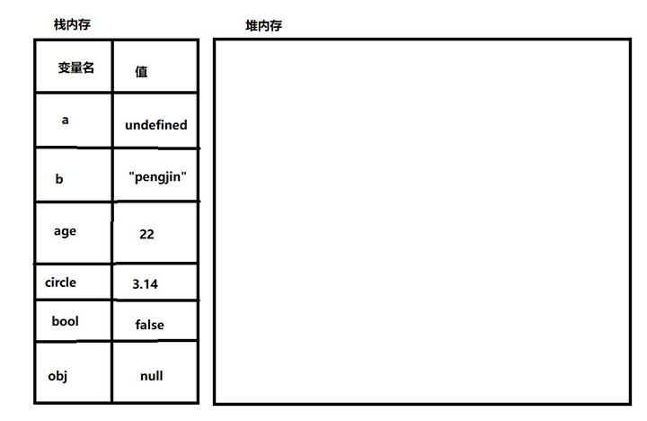

# 数据类型

**问题：为什么需要有数据类型呢？**

因为在计算机当中,计算机使用数据来描述不同性质的信息,而不同性质的信息需要使用不同的数据类型来区分。
比如:表达一个人的年龄我们使用数字类型,表达一个地址我们使用字符串类型来进行表达。

在Javascript当中有`基本数据类型（值类型）`和`引用数据类型`两大类:

## 五大基本数据类型

基本数据类型又称为值类型,一般存在于`栈内存`中,在es5当中支持以下五种基本数据类型：

**string**

JavaScript的字符串类型用于表示文本数据。
文本必须以双引号或单引号包围

**number**

根据 ECMAScript 标准，JavaScript 中只有一种数字类型：基于 IEEE 754 标准的双精度数值。在其他编程语言中，有不同的数字类型存在，比如：整型，单精度浮点型，双精度浮点型等。但在javascript中只有Number类型，表示整数或者浮点数
Number类型中还有几个特殊的值：+Infinity，-Infinity 和 NaN (非数值，Not-a-Number)

**boolean**

布尔表示一个逻辑实体，可以有两个值：true 和 false。

**null**

null表示一个空对象指针，如果定义的变量准备在将来用于保存对象，那么最好将该变量初始化为null而不是其他值。

**undefined**

undefined类型只有一个值，即undefined。未初始化的变量，都是undefined类型。

```html
<script type="text/javascript">
	var a; //undefine
	var b = "pengjin" //string
	var age = 22 //number
	var circle = 3.14 //number
	var bool = false // boolean
	var obj  = null // null
</script>
```

以上代码定义的变量都是`值类型`,存放在栈内存中。

