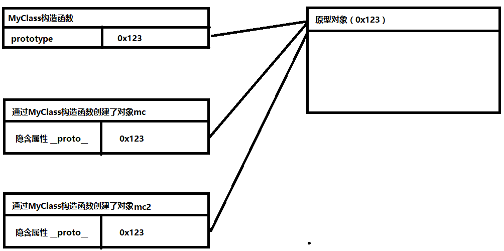

# 原型对象

我们所创建的每一个函数，解析器都会向函数中添加一个属性prototype,这个属性对应着一个对象，这个对象就是我们所谓的原型对象。

```javascript
function MyClass(){

}
//向MyClass的原型中添加属性Hello
MyClass.prototype.Hello = "hello world"

//向MyClass的原型中添加一个方法
MyClass.prototype.sayHello = function(){
    alert("hello");
};

var mc = new MyClass();			
var mc2 = new MyClass();

console.log(mc.Hello)
console.log(mc2.Hello)
```

如果函数作为普通函数调用prototype没有任何作用

```javascript
//普通调用MyClass函数,无法访问原型对象中的Hello属性
var mc3 = MyClass()
console.log(mc3.Hello)
```

当函数以构造函数的形式调用时，它所创建的对象中都会有一个隐含的属性，指向该构造函数的原型对象，我们可以通过__proto__来访问该属性.

```javascript
console.log(MyClass.prototype);
console.log(mc.__proto__ == MyClass.prototype);
console.log(mc2.__proto__ == MyClass.prototype);
```

以上代码如果用画图进行理解如下所示:

